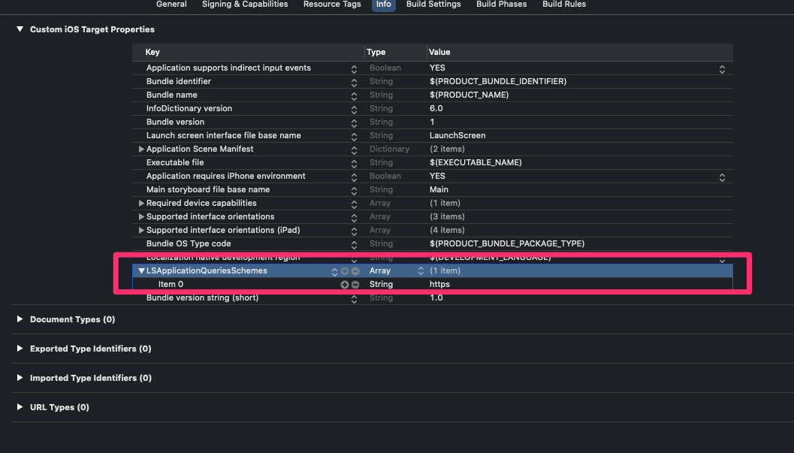

# iOS App 개발

## UI

[iOS App 개발(UI)](ios_dev_ui.md) 참조.

## 통신
### HTTP

**주의사항**
- 기본적으로 HTTPS가 권장된다. http::// URL을 계속 쓰고자 할 때는 설정을 건드려줘야 한다.
- IPv6를  지원해야 한다. (App Store 검수 관련)
  - IP어드레스를 직접 사용하지 말 것. (도메인 사용)
  - Socket 통신 API를 쓰지 말고, iOS가 제공하는 API 사용.

#### 로컬 캐시 문제
이미지 등의 파일을 받는 URL을 계속 호출하다 보면, 서버에서 파일 내용이 변경되었는데도 App에서는 계속 이전 내용으로 보이는 현상이 발생할 수 있다. 아마도 WebKit 엔진 자체에서 로컬 캐시를 적용하고 있는 듯.

만약, 반드시 최신 상태의 파일이 필요한 경우, 해결방법은 파일을 다운받는 URL이 매번 바뀌게 하는 것이다.
1. 서버에서 파일이 변경되면, 파일 이름을 다르게 한다든지 해서 다운로드하는 URL이 변경되게 만든다.
1. 다른 방법으로는, App에서  URL 뒤에 쿼리 스트링을 붙이고 항상 다른 값이 들어가게 한다.

두번째 방법은 App에서 간단히 처리가 가능한데, 예를들어 아래와 같은 URL로 파일을 받는 다고 하면,
```https://www.sample.com/data/some.png```

URL 뒤에 쿼리 스트링(?로 시작되는 부분)을 붙인다.
```https://www.sample.com/data/some.png?nocache=타임스탬프값```

이렇게 매번 호출되는 URL이 달라지면 캐시를 쓰지 않고, 항상 서버에서 파일을 받아오게 된다.

**Android 에서도 마찬가지!**<br/>
Android에서도 같은 방법으로 캐시 문제를 회피 할 수 있다.

### SMS

```objc
// Add: MessageUI.framework
#import <MessageUI/MessageUI.h>

- (BOOL)sendSms:(NSString*)message
{
    MFMessageComposeViewController *controller = [[MFMessageComposeViewController alloc] init];
    
    if ([MFMessageComposeViewController canSendText]) {
        controller.body = message;
        //controller.recipients = [NSArray arrayWithObjects:@"12345678", @"87654321", nil];
        controller.messageComposeDelegate = self;
    }
    else {
        return NO;
    }
    
    // Present the view controller modally. (in UIViewController class)
    [self presentViewController:controller animated:YES completion:nil];
    
    return YES;
}

- (void)messageComposeViewController:(MFMessageComposeViewController *)controller didFinishWithResult:(MessageComposeResult)result
{
    // Dismiss the mail compose view controller. (in UIViewController class)
    [self dismissViewControllerAnimated:YES completion:nil];
}
```

### Email

```objc
// Add: MessageUI.framework
#import <MessageUI/MessageUI.h>

- (void)sendEmailSubject:(NSString*)subject message:(NSString*)message
{
    MFMailComposeViewController* mailComposer = [[MFMailComposeViewController alloc] init];
    
    mailComposer.mailComposeDelegate = self;
    [mailComposer setSubject:subject];
    [mailComposer setMessageBody:message isHTML:NO];

    //Present the view controller modally. (in UIViewController class)
    [self presentViewController:mailComposer animated:YES completion:nil];
}

- (void)mailComposeController:(MFMailComposeViewController *)controller didFinishWithResult:(MFMailComposeResult)result error:(NSError *)error
{
    // Dismiss the mail compose view controller. (in UIViewController class)
    [self dismissViewControllerAnimated:YES completion:nil];
}
```

### URL Scheme

"line://msg/text/..." 등으로 특정 App의 스킴을 호출하고자 할 때, iOS9 이상에서는 다음과 같은 절차를 거쳐야 한다.

우선 **Info.plist**에 사용하고자 하는 App Scheme을 등록한다.

```xml
<!-- Info.plist -->
...
    <key>LSApplicationQueriesSchemes</key>
    <array>
      <string>line</string>
    </array>
...
```

실제 호출은 다음과 같이 한다.
```objc
BOOL openUrl(NSString* url_str)
{
    NSURL *myURL = [NSURL URLWithString:url_str];
    if ([[UIApplication sharedApplication] canOpenURL:myURL]) {
        [[UIApplication sharedApplication] openURL:myURL];
        return YES;
    }
    
    return NO;
}
```

요지는 canOpenURL:로 먼저 확인한 다음에, openURL:을 실행하라는 것.


### Bluetooth(BLE)

[Bluetooth(BLE)통신 구현](/lib/ble.md) 참조.

### TCP/IP
iOS 12부터 지원하는 Network.framework 사용을 권장.
```swift
class SocketConnection {
  private var connection: NWConnection!
  
  ///
  /// サーバーとの接続を確立する
  ///
  func connect(ip ipaddr: String, port: UInt32 = 11000) {
    print("connecting to \(ipaddr):\(port)")
    
    let svrHost = NWEndpoint.Host(ipaddr)
    let svrPort = NWEndpoint.Port(integerLiteral: UInt16(port))
    connection = NWConnection(host: svrHost, port: svrPort, using: .tcp)
    connection.stateUpdateHandler = { state in
      switch state {
      case .setup:
        break
        
      case .ready:
        printAppLog("Socket is Ready")
        self.receiveData(from: self.connection)
        
      case .waiting(let error):
        printAppLog("\(error.localizedDescription)")
        self.raiseTimeoutEvent()
        
      case .failed(let error):
        printAppLog("\(error.localizedDescription)")
        
      case .cancelled:
        printAppLog("cancelled")
        
      case .preparing:
        print("socket opened")
        
      @unknown default: break
      }
    }
    
    let queue = DispatchQueue(label: "socket")
    connection.start(queue: queue)
  }

  // ...
}
```

## IO
### iCloud
#### 준비

1. Apple Developer 사이트에서, iCloud Container 추가.
   1. 컨테이너 ID가 필요(역도메인 방식).  이 ID는 반드시 「iCloud.」로 시작.
1. App ID에서 iCloud를 활성화하고, iCloud Container 연결.
1. XCode에서 Capabilities → iCloud → 필요한 서비스를 체크(例: iCloud Documents)

#### iCloud Document
##### iCloud Document URL 획득

```swift
private var containerUrl: URL? {
　　　　let url = FileManager.default.url(forUbiquityContainerIdentifier: nil)?.appendingPathComponent("디렉토리 이름")
  do {
　　　　　　　　try FileManager.default.createDirectory(at: url!, withIntermediateDirectories: true, attributes: nil)
 　　} catch let error as NSError {
　　　　　　　　//エラー処理
  }
    return url
}
```

**forUbiquityContainerIdentifier**에 iCloud 컨테이너 ID를 지정할 수도 있다.

**appendingPathComponent** 부분에 필요한 디렉토리를 추가.

##### 다운로드 및 동기화
기본적으로 Cloud 드라이브랑 비슷한 방식으로 동작한다. 로컬 영역에 iCloud Document에 대응하는 디렉토리가 있고, 여기 내용을 iCloud 서버랑 수동으로 동기화를 시켜줘야 한다.

iCloud Document로 뭔가 작업을 하기 전에, 먼저 동기화를 시켜주자.
```swift
  func syncBackupData() -> Bool {
    let url = containerUrl?.appendingPathComponent("backup.csv")
    do {
      try FileManager.default.startDownloadingUbiquitousItem(at: url!)
      return true
    }
    catch {
      return false
    }
  }
```

##### 읽기/쓰기
iCloud 영역에 대응하는 URL을 이미 획득했으므로, 이 URL에 파일 입출력을 하기만 하면 된다.

## Media

**.ogg 형식은 지원안함**<br/>
iOS에서 제공하는 API로 재생가능한 형식에 .ogg는 빠져있다. Unity 엔진 등에서 작업할 때 주의(.mp3 포맷을 쓰자).

### Audio 재생

```swift
import AVFoundation

// Load
do {
  self.audioPlayer = try AVAudioPlayer(contentsOf: AUDIO_URL)
  self.audioPlayer.delegate = self
  self.audioPlayer.prepareToPlay()
} catch { }

// Play
self.audioPlayer.play()
self.audioPlayer.pause()
self.audioPlayer.stop()

// 전체 길이
let len: TimeInterval = self.audioPlayer.duration
// 재생 위치 변경
self.audioPlayer.currentTime = timeIntervalValue

extension SomeViewController: AVAudioPlayerDelegate {
  // 재생 완료시 처리
  func audioPlayerDidFinishPlaying(_ player: AVAudioPlayer, successfully flag: Bool) {}
}
```

### 동영상 재생
#### 동영상 표시
##### iOS에서 제공하는 동영상 재생용 뷰컨트롤러 활용

```swift
import AVFoundation
import AVKit

let avItem = AVPlayerItem(url: VIDEO_URL)
let avPlayer = AVPlayer(playerItem: avItem)

let playerController = AVPlayerViewController()
playerController.player = avPlayer
present(playerController, animated: true) { avPlayer.play() }
```

##### 화면 일부 영역에 동영상 표시

```swift
let avItem = AVPlayerItem(url: VIDEO_URL)
self.videoPlayer = AVPlayer(playerItem: avItem)

self.playerLayer = AVPlayerLayer(player: self.videoPlayer)
self.playerLayer.frame = CGRect(
  x: 0, y: 0,
  width: 100,
  height: 100
)
self.view.layer.addSublayer(self.playerLayer)
```

#### 재생관련
AVPlayer 인스턴스를 활용.
```swift
guard let player = self.videoPlayer else { return }

// 재생
player.play()

// 정지(stop은 없다)
player.pause()

// 이벤트
NotificationCenter.default.addObserver(self, selector: #selector(playerDidFinishPlaying), name: .AVPlayerItemDidPlayToEndTime, object: nil)
@objc func playerDidFinishPlaying(note: NSNotification) { } // 재생 완료시

// 재생 위치 이동
func setPlayPosition(time: TimeInterval) {
  // TimeInterval을 CMTime으로 변환
  let cmTime = CMTime(seconds: time, preferredTimescale: 1_000_000)
  self.videoPlayer.seek(to: cmTime)
}
```

### 동영상 촬영

```swift
guard UIImagePickerController.isSourceTypeAvailable(.camera) else { return }

let recController = UIImagePickerController()

recController.sourceType = .camera
recController.mediaTypes = [kUTTypeMovie as String]
recController.delegate = self

recController.allowsEditing = false
recController.showsCameraControls = false
recController.cameraOverlayView = createCameraOverlayView()


/// 카메라 화면에 오버레이시킬 뷰를 작성
private func createCameraOverlayView() -> UIView {
  let view = UIView(frame: self.view.frame)
  view.backgroundColor = UIColor(hexString: "#000", alpha: 0.0)
  
  let captureStopButton = UIButton()
  captureStopButton.layer.masksToBounds = true
  captureStopButton.backgroundColor = UIColor(hexString: "#ff0000", alpha: 0.7)
  captureStopButton.setTitle("終了", for: .normal)
  captureStopButton.frame = CGRect(x: 0, y: self.view.frame.height - 80, width: self.view.frame.width, height: 80)
  captureStopButton.addTarget(self, action: #selector(stopVideoCapture), for: .touchUpInside)
  view.addSubview(captureStopButton)
  captureStopButton.isHidden = true
  
  let toggleLightButton = UIButton()
  toggleLightButton.layer.masksToBounds = true
  toggleLightButton.makeRoundCornor()
  toggleLightButton.backgroundColor = UIColor(hexString: "#000", alpha: 0.7)
  toggleLightButton.setTitle("Light On/Off", for: .normal)
  toggleLightButton.frame = CGRect(x: 10, y: 10, width: 150, height: 50)
  toggleLightButton.addTarget(self, action: #selector(toggleCameraLight), for: .touchUpInside)
  view.addSubview(toggleLightButton)
  
  Timer.scheduledTimer(withTimeInterval: 3.5, repeats: false) { timer in
    captureStopButton.isHidden = false
    timer.invalidate()
  }

  return view
}

/// 촬영 종료
@objc func stopVideoCapture() {
  recController.stopVideoCapture()
}

/// 카메라 플래시 on/off
@objc func toggleCameraLight() {
  guard
    let avDevice = AVCaptureDevice.default(for: AVMediaType.video),
    avDevice.hasTorch
  else { return }
  
  if let _ = try? avDevice.lockForConfiguration() {
    avDevice.torchMode = AVCaptureDevice.TorchMode.off == avDevice.torchMode
      ? AVCaptureDevice.TorchMode.on
      : AVCaptureDevice.TorchMode.off
    avDevice.unlockForConfiguration()
  }
}

// 이벤트
extension SomeViewController: UIImagePickerControllerDelegate {
  func imagePickerControllerDidCancel(_ picker: UIImagePickerController) {
    // 촬영 취소시
  }
  
  func imagePickerController(_ picker: UIImagePickerController, didFinishPickingMediaWithInfo info: [UIImagePickerController.InfoKey : Any]) {
    if let selectedVideo: URL = (info[UIImagePickerController.InfoKey.mediaURL] as? URL) {
      // 촬영 완료시
    }
    picker.dismiss(animated: true)
  }
}
```

### Speech
#### Text to Speech

```objc
AVSpeechSynthesizer *synthesizer = [[AVSpeechSynthesizer alloc]init];
AVSpeechUtterance *utterance = [AVSpeechUtterance speechUtteranceWithString:@"Some text"];
[utterance setRate:0.2f];
[synthesizer speakUtterance:utterance];
```

#### Speech to Text
iOS 10에서 공식 지원.

필요한 프레임워크
- Speech.framework
- AVFoundation.framework

다음은 유니티 프로젝트에서 사용하기 위해 만든 Objective-c 코드의 일부.
```objc
#import <Speech/Speech.h>

@class UtilsForUnity;
UtilsForUnity* util = nil;

@interface UtilsForUnity: NSObject
{
    AVAudioEngine* audioEngine;
    AVAudioInputNode* inputNode;
    SFSpeechAudioBufferRecognitionRequest* recognitionRequest;
    
    NSString* recognitionResult;
    NSString* callbackObj;
    NSString* callbackFunc_result;
    NSString* callbackFunc_update;
}
@end

@implementation UtilsForUnity
- (void)startSpeechToText
{
    recognitionResult = @"";
    
    NSLocale* locale = [[NSLocale alloc] initWithLocaleIdentifier: @"en-US"];
    SFSpeechRecognizer* speechr = [[SFSpeechRecognizer alloc] initWithLocale: locale];
    speechr.delegate = nil; //self;
    
    AVAudioSession* audio_session = [AVAudioSession sharedInstance];
    
    NSLog(@"audio_session category: %@", audio_session.category);
    NSLog(@"audio_session mode: %@", audio_session.mode);
    
    [audio_session setCategory:AVAudioSessionCategoryRecord error:nil];
    [audio_session setMode:AVAudioSessionModeMeasurement error:nil];
    [audio_session setActive:TRUE withOptions:AVAudioSessionSetActiveOptionNotifyOthersOnDeactivation error:nil];
    
    recognitionRequest = [[SFSpeechAudioBufferRecognitionRequest alloc] init];
    recognitionRequest.shouldReportPartialResults = TRUE;
    
    [speechr recognitionTaskWithRequest:recognitionRequest resultHandler:^(SFSpeechRecognitionResult * _Nullable result, NSError * _Nullable error) {
        NSString* text = result.bestTranscription.formattedString;
        NSLog(@"** Speech to Text: %@", text);
        NSLog(@"** error: %@", error);
        
        if (error == nil) {
            recognitionResult = text;
            
            if (callbackFunc_update != nil && [callbackFunc_update length] > 0) {
                const char* cb_o = [callbackObj UTF8String];
                const char* cb_f = [callbackFunc_update UTF8String];
                UnitySendMessage(cb_o, cb_f, [recognitionResult UTF8String]);
            }
        }
    }];
    
    audioEngine = [[AVAudioEngine alloc] init];
    inputNode = audioEngine.inputNode;
    [inputNode installTapOnBus:0 bufferSize:1024 format:[inputNode outputFormatForBus:0] block:^(AVAudioPCMBuffer * _Nonnull buffer, AVAudioTime * _Nonnull when) {
        [recognitionRequest appendAudioPCMBuffer:buffer];
    }];
    
    [audioEngine prepare];
    [audioEngine startAndReturnError:nil];
}

- (void)stopSpeech
{
    const char* cb_o = [callbackObj UTF8String];
    const char* cb_f = [callbackFunc_result UTF8String];
    
//    NSLog(@"## recvObj: %s", cb_o);
//    NSLog(@"## recvFunc: %s", cb_f);
//    NSLog(@"## Result: %@", recognitionResult);
    
    UnitySendMessage(cb_o, cb_f, [recognitionResult UTF8String]);
    
    [audioEngine stop];
    [recognitionRequest endAudio];
    recognitionRequest = nil;

    // restore Audio Session !!
    // 녹음용으로 설정했기 때문에, 끝낼 때 원래 설정으로 복구해 주지 않으면, 이후 사운드가 출력이 안됨.
    AVAudioSession* audio_session = [AVAudioSession sharedInstance];
    [audio_session setCategory:AVAudioSessionCategoryAmbient error:nil];
    [audio_session setMode:AVAudioSessionModeDefault error:nil];
    [audio_session setActive:TRUE withOptions:AVAudioSessionSetActiveOptionNotifyOthersOnDeactivation error:nil];
}

- (void)setUnityCallbackObj:(NSString*)cbObj onResult:(NSString*)funcResult onUpdate:(NSString*)funcUpdate
{
    callbackObj = cbObj;
    callbackFunc_result = funcResult;
    callbackFunc_update = funcUpdate;
}

- (void)requestAuthorization
{
    [SFSpeechRecognizer requestAuthorization:^(SFSpeechRecognizerAuthorizationStatus status) {
        if (status == SFSpeechRecognizerAuthorizationStatusAuthorized) {
            NSLog(@"-- SFSpeechRecognizerAuthorizationStatusAuthorized --");
            [self startSpeechToText];
        }
    }];
}

@end

//--------------------------------------------------------

void startSpeechToText(const char* recvObj, const char* cbOnResult, const char* cbOnUpdate)
{
    if (!util) util = [[UtilsForUnity alloc] init];
    
    NSString* cb_o = [NSString stringWithUTF8String:recvObj];
    NSString* cb_r = [NSString stringWithUTF8String:cbOnResult];
    NSString* cb_u = [NSString stringWithUTF8String:cbOnUpdate];
    
    [util setUnityCallbackObj:cb_o onResult:cb_r onUpdate:cb_u];
    [util requestAuthorization];
}

void stopSpeech()
{
    if (util) [util stopSpeech];
}
```

그리고 이 기능을 사용하기 위해서는 다음은 내용을 **Info.plist**에 추가.
```xml
<dict>
  . . .
  <key>NSMicrophoneUsageDescription</key>
  <string>마이크 사용 권한에 대한 설명</string>
  <key>NSSpeechRecognitionUsageDescription</key>
  <string>음성인식 기능 이용에 대한 설명</string>
</dict>
```

## Custom URL Scheme
URL을 이용해 다른 앱을 실행시키고 정보를 전달할 수 있다.

https://developer.apple.com/documentation/xcode/allowing_apps_and_websites_to_link_to_your_content/defining_a_custom_url_scheme_for_your_app


### 호출하는 App

```swift
let url = URL(string: "myphotoapp:Vacation?index=1")

if UIApplication.shared.canOpenURL(url) {
    UIApplication.shared.open(url!) { (result) in
        if result {
           // The URL was delivered successfully!
        }
    }    
}       
```

#### info.plist 설정

https://qiita.com/tsuruken/items/58d1a5827262e629b03d

**LSApplicationQueriesSchemes**에 사용자 정의 scheme 이름을 추가.<br>


### 호출받는 App
Applecation Delegates에서 처리하는 경우
```swift
func application(_ application: UIApplication,
                 open url: URL,
                 options: [UIApplicationOpenURLOptionsKey : Any] = [:] ) -> Bool {
    
    // Determine who sent the URL.
    let sendingAppID = options[.sourceApplication]
    print("source application = \(sendingAppID ?? "Unknown")")
    
    // Process the URL.
    guard let components = NSURLComponents(url: url, resolvingAgainstBaseURL: true),
        let albumPath = components.path,
        let params = components.queryItems else {
            print("Invalid URL or album path missing")
            return false
    }
    
    if let photoIndex = params.first(where: { $0.name == "index" })?.value {
        print("albumPath = \(albumPath)")
        print("photoIndex = \(photoIndex)")
        return true
    } else {
        print("Photo index missing")
        return false
    }
}
```

Scene Delegates에서 처리하는 경우
```swift
// URL과 함께 앱이 기동하는 경우
func scene(_ scene: UIScene, 
           willConnectTo session: UISceneSession, 
           options connectionOptions: UIScene.ConnectionOptions) {

    // Determine who sent the URL.
    if let urlContext = connectionOptions.urlContexts.first {

        let sendingAppID = urlContext.options.sourceApplication
        let url = urlContext.url
        print("source application = \(sendingAppID ?? "Unknown")")
        print("url = \(url)")
            
        // Process the URL similarly to the UIApplicationDelegate example.
    }
}

// 이미 앱이 기동 중인 경우
func scene(_ scene: UIScene, openURLContexts URLContexts: Set<UIOpenURLContext>) {
    if let urlContext = URLContexts.first {
        let url = urlContext.url

        if let rootVC = UIApplication.shared.windows.first?.rootViewController as? UINavigationController,
           rootVC.viewControllers.isEmpty == false
        {
            // TODO
        }
    }
}
```

#### info.plist 설정

[Xcode register url scheme](Xcode_register_url_scheme.png)

## Tips

### 화면꺼짐(절전모드) 방지

```objc
#import <Foundation/Foundation.h>

void setKeepScreenOn() {
    [UIApplication sharedApplication].idleTimerDisabled = YES;
}
```

### iOS Version 확인

**Objective-C**<br/>
```objc
if ([[[UIDevice currentDevice] systemVersion] floatValue] < 8.0) {
  //older than iOS 8 code here
} else {
  //iOS 8 specific code here
}
```

**Swift**<br/>
```swift
// 1.
let systemVersion = UIDevice.current.systemVersion

// 2.
if #available(iOS 9.0, *) {
    // use the feature only available in iOS 9
    // for ex. UIStackView
} else {
    // or use some work around
}
```

### File App 지원
App의 Document 경로에 있는 파일들을 _File App_의 _このiPhone内_ 항목에서 보이게 하는 설정.

**info.plist**에서 다음 항목들을 추가하고 **YES**로 설정한다.
- Application supports iTunes file sharing = YES
- Supports opening documents in place = YES

## Framework
### Framework 만들기
1. 프레임워크 프로젝트를 만든다.
   1. File → New → Project... → Cocoa Touch Framework
1. Edit Scheme... → Run → Build Configuration = Release로 변경
1. Build Settings 변경
   1. [iOS Framework의 bitcode 문제](#Framework의-bitcode-문제) 참조.

### Frameowrk 빌드 및 사용
프레임워크를 빌드(Build)하고, 프로젝트 트리의 Products 그룹에 있는 xxx.frameowrk 파일에서 오른쪽 마우스 메뉴를 열고 **Show in Finder**를 선택하면, 프레임워크 파일이 있는 경로가 열린다.

xxx.frameowrk 파일을 심어 넣고자 하는 App 프로젝트의 적절한 경로에 복사해 둔다.

App 프로젝트에서, General → Embedded Binaries에 프레임워크 파일을 추가한다. 그러면 자동으로 Linked Frameworks and Libries에도 자동으로 추가가 된다.

### Framework의 bitcode 문제

**링크된 framework가 bitcode로 빌드되어 있지 않다고 나오는 경우(Archive 단계)**<br/>
분명히 프레임워크를 빌드할 때, bitcode를 활성화 했는데도, 이런 에러가 나는 경우가 있다. 이는 정확히는 해당 프레임워크가 full-bitcode로 빌드되어 있지 않은 경우다. 일반적으로 XCode 프로젝트에서는 bitcode를 활성하 하더라도 **Build**단계에서 비트코드에 대한 마킹만 해둔다. 그리고 **Archive**를 할 때 비로소 bitcode가 완전히 적용된다.

#### 해결방법
프레임워크 프로젝트의 Build Settings을 고쳐준다.

* Build Options → Enable Bitcode = YES
* Deployment → Skip Install = YES
* User-Defined → BITCODE_GENERATION_MODE (※추가) = bitcode

## Carthage
参照
* https://github.com/Carthage/Carthage
* https://qiita.com/yutat93/items/97fe9bc2bf2e97da7ec1

### Install

```
$ brew install carthage
```

### 프로젝트에 적용
프로제트 디렉토리에서 **Carfile**을 생성

```
$ touch Cartfile
```

그리고, Cartfile 내용을 편집해서 추가할 프레임워크들의 GitHub 정보를 추가. 버전 정보는 생략가능.
```
github "유저이름/저장소이름" ~> a.b.c
```
그리고 업데이트.
```
$ carthage update --platform iOS
```
Xcode 프로젝트를 열고, **Linked Frameworks and Libraries** 탭에서 _Carthage/Build/iOS/프레임워크_이름.framework_ 를 추가.

#### 빌드 설정
**Build Phases**에서 **New Run Script Phase** 추가.

Shell
```
/usr/local/bin/carthage copy-frameworks
```
input files
```
$(SRCROOT)/Carthage/Build/iOS/프레임워크_이름.framework
```

### 자작 프레임워크에서 Carthage 지원하기
빌드 가능한 프레임워크 및 소스들이 GitHub에 올려져 있을 것.

그리고 Git Tag로 버전 정보를 추가 한다.
```
git tag 1.0.0
git push --tags
```
버전은 반드시 "메이져.마이너.패치" 방식으로 붙일 것.

## App Store 검수
[App Store 검수](app_store.md) 참고.
