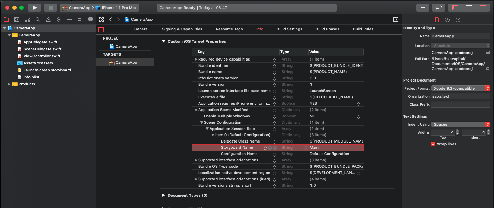

# iOS App 개발(UI)

## Base Language 변경

1. Close Xcode.
1. Open your **project.pbxproj** in a text editor
1. Look for **developmentRegion** and set its value (es for spanish, fr for french,...)
1. Look for **knownRegions** and add the new language to the list
1. Open Xcode: Your project info should now show the language name with Development Language next to it.

## Interface Builder 관련
### Storyboard 없이 앱 개발

1. 프로젝트 설정의 General → Deployment Info 그룹 → Main interface 항목을 **비워놓는다**.
1. AppDelegate.swift 에서, 직접 루트 뷰 컨트롤러를 지정.

```swift
import UIKit

@UIApplicationMain
class AppDelegate: UIResponder, UIApplicationDelegate {

  var window: UIWindow?
  
  func application(_ application: UIApplication, didFinishLaunchingWithOptions launchOptions: [UIApplication.LaunchOptionsKey: Any]?) -> Bool {
    self.window = UIWindow(frame: UIScreen.main.bounds)

    let mainController = UINavigationController()
    mainController.pushViewController(HomeViewController(), animated: false)
    
    self.window?.rootViewController = mainController
    self.window?.makeKeyAndVisible()
    
    return true
  }
// . . .
}
```

#### Scene Delegate 삭제 (iOS 13 이상)

1. SceneDelegate.swift 파일 삭제
1. Info.plist에서 **.SceneDelegate**로 검색해서, 해당 부분(UIApplicationSceneManifest 항목)을 삭제(key와 dict 포함).

```xml
  <key>UIApplicationSceneManifest</key>
  <dict>
    <key>UIApplicationSupportsMultipleScenes</key>
    <false/>
    <key>UISceneConfigurations</key>
    <dict>
      <key>UIWindowSceneSessionRoleApplication</key>
      <array>
        <dict>
          <key>UISceneConfigurationName</key>
          <string>Default Configuration</string>
          <key>UISceneDelegateClassName</key>
          <string>$(PRODUCT_MODULE_NAME).SceneDelegate</string>
          <key>UISceneStoryboardFile</key>
          <string>Main</string>
        </dict>
      </array>
    </dict>
  </dict>
```

### Storyboard 없이 앱 개발 (iOS13 이상만 지원할 경우)

1. 프로젝트 설정의 General → Deployment Info 그룹 → Main interface 항목을 **비워놓는다**.

2. 프로젝트에서 스토리보드 파일 삭제

3. Info.plist에서 스토리보드 파일연결 제거<br/>


4. SceneDelegate.swift 수정
```swift
    func scene(_ scene: UIScene, willConnectTo session: UISceneSession, options connectionOptions: UIScene.ConnectionOptions) {
        guard let windowScene = (scene as? UIWindowScene) else { return }
        window = UIWindow(frame: windowScene.coordinateSpace.bounds)
        window?.windowScene = windowScene
        window?.rootViewController = ViewController()
        window?.makeKeyAndVisible()
    }
```

### 동적으로 .xib 파일 로딩
#### ViewController를 이용하는 방법
.xib 파일을 만들 때, 대응되는 ViewController class를 정의한 다음, 해당 ViewController의 인스턴스를 생성하는 방식.

인터페이스 빌더로 화면을 만들고, 별도로 ViewController 클래스를 작성한 다음, 인터페이스 빌더의 컨트롤과 @IBOutlet 으로 연결되기만 하면 되는 듯. 이후는 일반적인 ViewController 사용법과 다르지 않음.

#### View를 동적으로 로딩
원래 목적대로, .xib 파일을 동적으로 로딩해서, 뷰에 추가하는 방식.

1. 인터페이스 빌더로 뷰를 구성
1. 뷰에 대응하는 클래스(UIView)를 작성
1. 인터페이스 빌더에서, 최상위 뷰를 선택해고, Custom Class → Class 항목을 위에서 작성한 뷰로 연결
   1. 그리고 필요에 따라 @IBOutlet 등을 지정

그리고 코드에서 사용할 때는,
```swift
// xib 로딩: UINib(nibName: "xxx.xib 파일명에서 xxx부분", bundle: nil /* nil이면 메인 번들에서 가져온다 */)
let loadedView = UINib(nibName: "CustomView", bundle: nil).instantiate(withOwner: self, options: nil)[0] as? CustomView
```

## Statusbar
### Landscape때 Statusbar 표시
iOS 8 이후로, Landscape일때 기본적으로 statusbar를 표시하지 않게 되어있다. 표시하기 위해서는 다음과 같이 한다.
```swift
//UIViewController
override func prefersStatusBarHidden() -> Bool { return false }
```

### StatusBar 색 변경

https://freakycoder.com/ios-notes-13-how-to-change-status-bar-color-1431c185e845

```swift
extension UIViewController {
  public func changeStatusBar(color: UIColor) {
    if #available(iOS 13, *) { // iOS 13 이상의 경우
      // 이 코드는 검증이 필요.
      let statusBarHeight: CGFloat = UIApplication.shared.statusBarFrame.size.height

      let statusbarView = UIView()
      statusbarView.backgroundColor = UIColor.red
      view.addSubview(statusbarView)

      statusbarView.translatesAutoresizingMaskIntoConstraints = false
      statusbarView.heightAnchor.constraint(equalToConstant: statusBarHeight).isActive = true
      statusbarView.widthAnchor.constraint(equalTo: view.widthAnchor, multiplier: 1.0).isActive = true
      statusbarView.topAnchor.constraint(equalTo: view.topAnchor).isActive = true
      statusbarView.centerXAnchor.constraint(equalTo: view.centerXAnchor).isActive = true
    }
    else {
      let statusBar = UIApplication.shared.value(forKeyPath: "statusBarWindow.statusBar") as? UIView
      statusBar?.backgroundColor = color
    }
  }
}
```

## View
### ViewController

#### UINavigationViewController
스와이프 제스쳐로 Back되는 기능 막기.
```swift
navigationController?.interactivePopGestureRecognizer?.isEnabled = false
```

### 뷰를 화면 하단에 고정
광고 등을 배치할 때 유용.
```objc
float y = [UIScreen mainScreen].bounds.size.height - myView.frame.size.height;
[myView setFrame:CGRectMake(0, y, myView.frame.size.width, myView.frame.size.height)];
```

### 현재 최상단에 떠 있는 뷰 가져오기

```objc
UIViewController* getRootViewCtrl()
{
  id<UIApplicationDelegate> appDelegate = [[UIApplication sharedApplication] delegate];
  return appDelegate.window.rootViewController;
}

UIView* getRootView()
{
  return getRootViewCtrl().view;
}
```

### dismiss()를 해도 View가 사라지지 않는 경우
뷰가 아직 화면에 표시되지 않았는데 dismiss() 메세지를 날린 경우가 이에 해당될 수 있다.

예를들어 **override func viewWillAppear(_ animated: Bool)** 이벤트 안에서 dismiss()가 호출되는 경우 등. 이 경우는 **override func viewDidAppear(_ animated: Bool)**에서 처리하자.

## WebView

### Calling JavaScript function from Objective-C

```objc
[myWebView stringByEvaluatingJavaScriptFromString:@"myJavascriptFunction()"];
```

### Calling Swift Methods From JavaScript in a UIWebView

```swift
class MainViewController: UIViewController {
    override func viewDidLoad() {
        super.viewDidLoad()

        let webConfiguration = WKWebViewConfiguration()
        webView = WKWebView(frame: .zero, configuration: webConfiguration)
        webView.isOpaque = false
        webView.backgroundColor = .white
        webView.uiDelegate = self
        webView.navigationDelegate = self
        view.addSubview(webView)
        
        let request = URLRequest(url: URL_MAIN_PAGE)
        webView.load(request)
    }
}

extension MainViewController: WKUIDelegate, WKNavigationDelegate {    
    func webView(_ webView: WKWebView, decidePolicyFor navigationAction: WKNavigationAction, decisionHandler: @escaping (WKNavigationActionPolicy) -> Void) {
        if let url = navigationAction.request.url {
            checkCallFromJs(url: url)
        }
        decisionHandler(.allow)
    }
    
    func checkCallFromJs(url: URL) {
        print(url.absoluteString)
        guard
            url.scheme == "YOUR_API",
            let funcName = url.host
        else { return }
        
        switch funcName {
        case "logout": logout()
        
        case "apiWithParam":
            let param = url.path
            apiWithParam(lang: param)
            
        default: return
        }
    }
    
    func logout() {
        print(#function)
        dismiss(animated: true, completion: nil)
    }

    func apiWithParam(lang: String) {
        print(#function)        
    }    
}
```

```javascript
function logout() {
    location.href = 'YOUR_API://logout';
}

function apiWithParam(p) {
    location.href = 'YOUR_API://apiWithParam/' + p;
}
````

## ImagePicker

```objc
- (void) showImagePicker
{
    UIImagePickerController *imagePicker = [[UIImagePickerController alloc] init];
    imagePicker.sourceType = UIImagePickerControllerSourceTypePhotoLibrary;
    
    [imagePicker setDelegate:self];
    [getRootViewCtrl() presentViewController:imagePicker animated:YES completion:nil];
}

- (void)imagePickerController:(UIImagePickerController *)picker didFinishPickingMediaWithInfo:(NSDictionary *)info
{
    [picker dismissViewControllerAnimated:YES completion:nil];
    
  NSURL* imageUrl;
  NSString* path;
  if (@available(iOS 11.0, *)) {
    imageUrl = [info objectForKey: UIImagePickerControllerImageURL];
    NSString* path = imageUrl.path;
    NSLog(@"File Path: %@", path);

    //UIImage* img = [info objectForKey: UIImagePickerControllerOriginalImage];
  }
  // . . .
}
```

## TextField
### Read Only 설정

```swift
let editText = UITextField(frame: ...)
editText.isUserInteractionEnabled = false
```


## iOS15対応

### iOS 15でNavigationBarとTabBarがデフォルトで透過される
https://blog.personal-factory.com/2021/12/29/ios15-transparent-navigationbar-and-tabbar-by-default/

iOS 15アプリをXcode 13以上でビルドすると、NavigationBarとTabBarの背景が透過される。

_scrollEdgeAppearance_ 問題。

**NavigationBarをiOS 14以前と同じ見た目にする**
```swift
// class AppDelegate
func application(_ application: UIApplication, didFinishLaunchingWithOptions launchOptions: [UIApplication.LaunchOptionsKey: Any]?) -> Bool {
  // ...        
  if #available(iOS 15.0, *) {
    // disable UINavigation bar transparent
    let navigationBarAppearance = UINavigationBarAppearance()
    navigationBarAppearance.configureWithDefaultBackground()
    UINavigationBar.appearance().standardAppearance = navigationBarAppearance
    UINavigationBar.appearance().compactAppearance = navigationBarAppearance
    UINavigationBar.appearance().scrollEdgeAppearance = navigationBarAppearance
  }
  // ...        
}
```

**TabBarをiOS 14以前と同じ見た目にする**
```swift
// class AppDelegate
func application(_ application: UIApplication, didFinishLaunchingWithOptions launchOptions: [UIApplication.LaunchOptionsKey: Any]?) -> Bool {
  // ...        
  if #available(iOS 15.0, *) {
    // disable UITab bar transparent
    let tabBarAppearance: UITabBarAppearance = UITabBarAppearance()
    tabBarAppearance.configureWithDefaultBackground()
    UITabBar.appearance().scrollEdgeAppearance = tabBarAppearance
    UITabBar.appearance().standardAppearance = tabBarAppearance
  }
  // ...        
}
```
