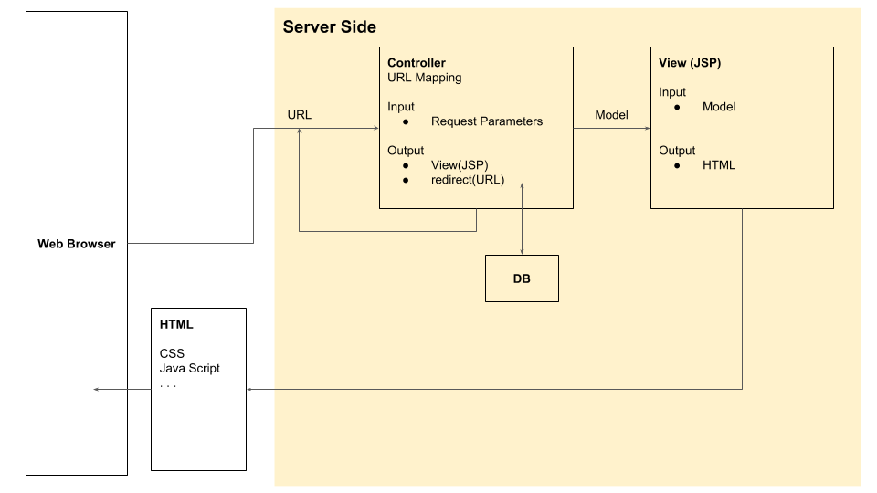

# Spring Boot

## 프로젝트 설정
### UTF-8 지원설정
Make sure you register Spring's CharacterEncodingFilter in your web.xml (must be the first filter in that file).
```xml
<filter>  
    <filter-name>encodingFilter</filter-name>  
    <filter-class>org.springframework.web.filter.CharacterEncodingFilter</filter-class>  
    <init-param>  
       <param-name>encoding</param-name>  
       <param-value>UTF-8</param-value>  
    </init-param>  
    <init-param>  
       <param-name>forceEncoding</param-name>  
       <param-value>true</param-value>  
    </init-param>  
</filter>  
<filter-mapping>  
    <filter-name>encodingFilter</filter-name>  
    <url-pattern>/*</url-pattern>  
</filter-mapping> 
```

### MySQL 사용하기
https://qiita.com/neriai/items/549617569b1b719eb84d

#### 접속 환경 설정
pom.xmlを開き、内の最終行に追加してください。
```xml
<dependency>
    <groupId>mysql</groupId>
    <artifactId>mysql-connector-java</artifactId>
    <version>5.1.45</version>
</dependency>

<dependency>
    <groupId>org.springframework</groupId>
    <artifactId>spring-jdbc</artifactId>
    <version>${org.springframework-version}</version>
</dependency>
```

プロジェクトを右クリックし、「実行 > Maven clean」を実行します。<br />
同じく、「実行 > Maven install」を実行します。

root-context.xmlを開き、内の最終行に追加してください。
```xml
<bean id="dataSource"
    class="org.springframework.jdbc.datasource.DriverManagerDataSource">
    <property name="driverClassName">
        <value>com.mysql.jdbc.Driver</value>
    </property>
    <property name="url">
        <value>jdbc:mysql://localhost:3306/db_name?useUnicode=true&amp;characterEncoding=utf8</value>
    </property>
    <property name="username">
        <value>root</value>
    </property>
    <property name="password">
        <value></value>
    </property>
</bean>
```

※ 유니코드 문자가 포함된 SQL문을 실행하고자 할 때, jdbc 연결 URL에 다음을 추가한다.
```xml
?useUnicode=true&amp;characterEncoding=utf8
```

#### Controller
```java
/**
 * Handles requests for the application home page.
 */
@Controller
public class HomeController {

    @Autowired
    private JdbcTemplate jdbcTemplate;

    @RequestMapping(value = "/", method = RequestMethod.GET)
    public String home(Locale locale, Model model) {
        final List<Map<String, Object>> list = jdbcTemplate.queryForList("SELECT * FROM users");
        model.addAttribute("data", list.get(0).get("name") );
        return "home";
    }
}
```

#### View
```jsp
<%@ taglib uri="http://java.sun.com/jsp/jstl/core" prefix="c" %>
<%@ page session="false" %>
<html>
    <head>
        <title>Home</title>
    </head>
    <body>
    <h1>
        Hello world!  
    </h1>
    <p>  DB's data is ${data}. </p>
    </body>
</html>
```

## Server 설정
### WebApps 이외의 다른 리소스에 접근하는 URL 설정 (Tomcat/server.xml)
server.xml에 다음을 추가.
```xml
<Context docBase="원본 경로"  path="/맵핑할URL" />
```

Tomcat 재시작 필요.

例）
```xml
<Server port="8025" shutdown="SHUTDOWN">
 ...
  <Service name="Catalina">
    ...
    <Engine defaultHost="localhost" name="Catalina">
     ...
     <Host appBase="webapps"
      autoDeploy="false" name="localhost" unpackWARs="true"
      xmlNamespaceAware="false" xmlValidation="false">
      ...
       <Context  docBase="/var/project/images" path="/project/images" />
      </Host>
    </Engine>
  </Service>
</Server>
```

**주의!! 반드시 실제하는 경로를 지정할 것**<br/>
존재하지 않은 경로로 server.xml을 변경한 다음에 Tomcat을 실행시키면 에러가 난다.


## 개념


